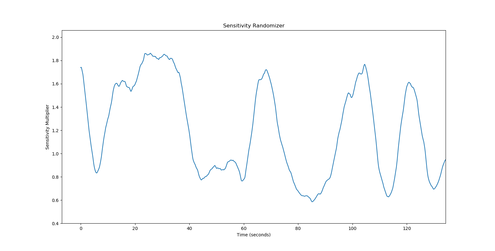
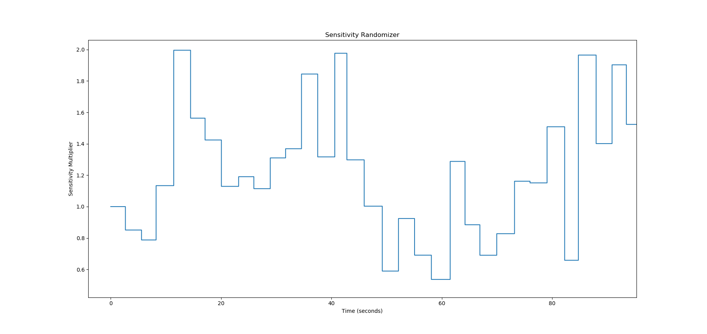

# Smooth Sensitivity Randomizer

**By: Whisper & El Bad**

## Overview

This tool generates smooth or step-like, randomized sensitivity multiplier curves around a baseline value using [Interception](http://www.oblita.com/interception.html) and [Armadillo](http://arma.sourceforge.net/) in C++. The goal of this tool is to begin to understand the effects of varying mouse sensitivities while aim training.

Ideally, this is something to occasionally **_train_** with, but not to have active during actual gameplay. While there's no concrete proof to back this up, we feel smoothly varying sensitivity might increase reactivity and help train fine motor movements in a way that's superior to keeping with a single sensitivity. Thus, the target audience will be people who play aim trainers such as [Kovaak's FPS Aim Trainer](https://store.steampowered.com/app/824270/KovaaKs_FPS_Aim_Trainer/).

## Instructions

### *1) Download the program*

* Clicking the download link below will give you access to **_all_** the files needed to successfully run this tool.

| [Download Here!](https://github.com/Whisperrr/SensitivityChanger/releases/download/v0.4/SensitivityRandomizer.zip)|     
| ------------- |

* You may also download the *SensitivityRandomizer.zip* file directly from my [releases](https://github.com/Whisperrr/SensitivityChanger/releases).  
* Or clone/download the repo from my [GitHub](https://github.com/Whisperrr/SensitivityChanger).

### *2) Install Interception*

Once you extract the ZIP file, you must first install Interception. More on what that is in the _Details_ section if you care.

The process is _very_ similar to Kovaak and Povohat's [InterAccel](http://mouseaccel.blogspot.com/2015/12/new-method-for-mouse-acceleration.html), thus some of the installation code/executables are borrowed from them.

1) Double click the *install_driver.bat* file from the extracted ZIP file (It will ask for Admin priviledges).
2) Install the Visual C++ Redistributable for Visual Studio 2015 from https://www.microsoft.com/en-us/download/details.aspx?id=48145 if you don't have it.
3) Reboot. Yes, you actually need to reboot because of first step, or it won't work.

Once this is done, you should be able to run the tool.

### *3) Run the program*

* Run the **_SensitivityRandomizer.exe_** file located in your extracted ZIP folder.

**Note:** The program will begin to generate a complete sensitivity curve. Your mouse may initially freeze for a few seconds while generating this curve.

This program will look for a _settings.ini_ file that contains several key pieces of information. If no settings file is found, it will use default values I've chosen. These values are:

* Smooth
* Baseline_Sensitivity
* Min_Sensitivity
* Max_Sensitivity
* Spread
* Smoothing
* Timestep
* Runtime (minutes)
* Visualize
* Debug

The *Smooth* value determines whether you want your generated sensitivities to be *step-like* or *smooth*. It takes on two values: **0** (step-like) or **1** (smooth). Setting Smooth = **1** will result in a sensitivity curve similar to this:

whereas setting Smooth = **0** will result in something like this:

The *Baseline_Sensitivity* value determines determines where you'd like to vary your sensitivity multiplier around. **This should almost always be set to 1**, as this means you'll vary your sensitivity around a value *1x* your current sensitivity value (aka still your current sensitivity).

The *Min_Sensitivity* and *Max_Sensitivity* values determine the largest and smallest multipliers that you want your sensitivity to reach. I usually keep Min_Sensitivity = **0.50** (half your default sensitivity), and Max_Sensitivity = **2** (twice your default sensitivity).

_Spread_ determines how crazy you want your curve to look. Small spread values result in small deviations around the baseline, while large spread values result in large/fast deviations. I'll be tweaking this in the future, but for now, I keep it at **0.6**.

_Smoothing_ (added in v0.3 and different to the *Smooth* value previously) determines, well, how smooth you'd like your randomization to be (given that you choose a *smooth* graph rather than *step-like*). The smoothing parameter can take on several values:

* 0: No smoothing performed (interesting option to say the least)
* 1: Low amount of smoothing
* 2: Medium amount of smoothing
* 3: High amount of smoothing
* 4: Very high amount of smoothing
* 5: This smooth: https://www.youtube.com/watch?v=ZMByI4s-D-Y

I have this value set to **2** by default.

*Timestep* (added in v0.5) allows you to control how **often** your sensitivity changes when using the step-like sensitivity randomization option. By default, I have this set to **10**, meaning your sensitivity will change once every *ten* seconds.

*Runtime (minutes)* - Determines how long you want your program to run for before you need to restart. I keep this value at **30** (for 30 minutes).

*Visualize* allows you to visualize the sensitivity curve the tool generates. By default, this is set to **0** (so no visualization), however setting it to 1 will generate a .txt file called "sens_list.txt". For now, I've included a script called _visualize.py_ that can be run to visualize this output.

**Note:** You'll need to first have [Python](https://realpython.com/installing-python/) _and_ [matplotlib](https://matplotlib.org/3.1.1/users/installing.html) installed.

*Debug* lets you see a live value of your current sensitivity multiplier and a live percentage of time left before needing to restart. By default this is set to **1**, however if you're experiencing any performance issues, I'd recommend setting this to 0.

***

Also, you can press __"P"__ on your keyboard to pause/unpause the program (toggle). So if you find a particular sensitivity you like (or hate for that matter), you can now pause to practice it for a while. It's sort of finicky though, and requires you to stop moving your mouse before pressing. With the "Debug" option set to 1, you'll be able to see a _PAUSE_ icon appear.

## Details

If you'd like to know more about how the program actually works, please see [this Reddit post](https://www.reddit.com/r/FPSAimTrainer/comments/cve6oi/tool_for_smoothly_randomizing_sensitivity/) where I describe exactly that! If you have any issues running the program, you can:
* Message **Whisper#4442** or **El Bad#5788** on Discord.
* Join the official [FPS Aim Trainer Discord](https://discordapp.com/invite/Z8hGxnM).
